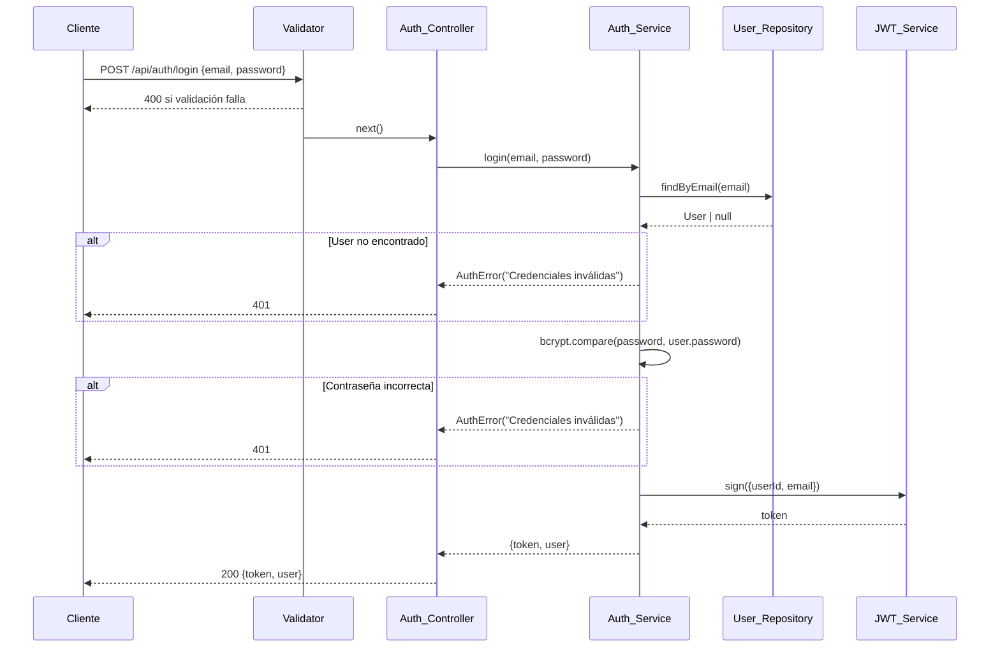
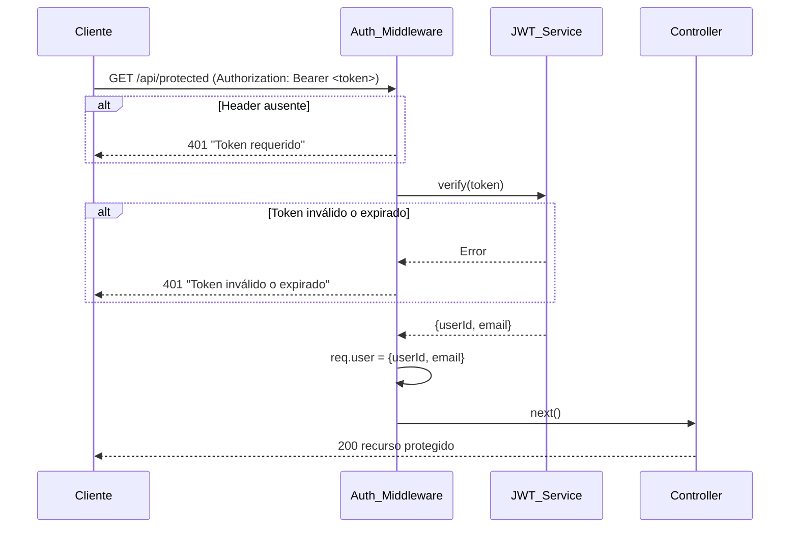

# Diseño Técnico: deudasmart-auth-backend

## Visión General

El módulo de autenticación de DeudaSmart expone un endpoint de login (`POST /api/auth/login`) y un middleware de protección de rutas basado en JWT. La arquitectura sigue el patrón **Rutas → Controladores → Services → Repositorios**, aplicando principios SOLID e inyección de dependencia para mantener cada capa desacoplada y testeable.

Stack tecnológico:

| Tecnología | Versión | Rol |
|---|---|---|
| Node.js | 20 LTS | Runtime |
| TypeScript | 5.x | Lenguaje |
| Express | 4.x | Framework HTTP |
| TypeORM | 0.3.x | ORM |
| PostgreSQL | 15.x | Base de datos |
| bcrypt | 5.x | Hash de contraseñas |
| jsonwebtoken | 9.x | Generación/verificación JWT |
| express-validator | 7.x | Validación de entrada |
| Jest | 29.x | Testing unitario |
| fast-check | 3.x | Property-based testing |

---

## Arquitectura

El sistema sigue una arquitectura en capas con flujo unidireccional de dependencias:

```
HTTP Request
     │
     ▼
┌─────────────┐
│  Auth_Router │  (Express Router)
└──────┬──────┘
       │
       ▼
┌──────────────────┐
│  Validator       │  (express-validator middleware)
└──────┬───────────┘
       │
       ▼
┌──────────────────┐
│  Auth_Controller │  (maneja HTTP, delega lógica)
└──────┬───────────┘
       │
       ▼
┌──────────────────┐
│  Auth_Service    │  (lógica de negocio)
└──────┬───────────┘
       │
  ┌────┴────┐
  ▼         ▼
┌──────────────┐  ┌──────────────┐
│User_Repository│  │  JWT_Service │
└──────┬───────┘  └──────────────┘
       │
       ▼
┌──────────────┐
│  PostgreSQL  │
└──────────────┘
```

Para rutas protegidas, el `Auth_Middleware` intercepta la petición antes del controlador:

```
HTTP Request → Auth_Router → Auth_Middleware → Controller
```

### Principios SOLID aplicados

- **S** — Cada clase tiene una única responsabilidad (Service, Repository, JWT_Service son clases separadas).
- **O** — Las interfaces permiten extender sin modificar (e.g., cambiar el algoritmo de hash sin tocar el Service).
- **L** — Las implementaciones concretas son intercambiables por sus interfaces.
- **I** — Interfaces pequeñas y específicas por capa.
- **D** — Las dependencias se inyectan en el constructor, nunca se instancian internamente.

---

## Estructura de Carpetas

```
src/
├── modules/
│   └── auth/
│       ├── auth.router.ts          # Define rutas del módulo
│       ├── auth.controller.ts      # Maneja req/res HTTP
│       ├── auth.service.ts         # Lógica de negocio
│       ├── auth.service.interface.ts
│       ├── auth.middleware.ts      # Validación JWT en rutas protegidas
│       ├── auth.validator.ts       # Reglas express-validator
│       └── dto/
│           ├── login.request.dto.ts
│           └── login.response.dto.ts
├── models/
│   └── user.entity.ts              # Entidad TypeORM
├── repositories/
│   ├── user.repository.interface.ts
│   └── user.repository.ts          # Implementación TypeORM
├── services/
│   ├── jwt.service.interface.ts
│   └── jwt.service.ts              # Generación/verificación JWT
├── config/
│   └── database.ts                 # Configuración TypeORM DataSource
├── app.ts                          # Configuración Express
└── index.ts                        # Entry point
```

---

## Componentes e Interfaces

### IUserRepository

```typescript
export interface IUserRepository {
  findByEmail(email: string): Promise<User | null>;
}
```

### IJwtService

```typescript
export interface IJwtService {
  sign(payload: JwtPayload): string;
  verify(token: string): JwtPayload;
}

export interface JwtPayload {
  userId: string;
  email: string;
}
```

### IAuthService

```typescript
export interface IAuthService {
  login(email: string, password: string): Promise<LoginResult>;
}

export interface LoginResult {
  token: string;
  user: { userId: string; email: string };
}
```

### Auth_Controller

Recibe `req`, `res`. Llama a `authService.login()`. Mapea resultados a respuestas HTTP. No contiene lógica de negocio.

### Auth_Middleware

Función Express middleware. Extrae el Bearer token del header `Authorization`, llama a `jwtService.verify()`, adjunta el payload a `req.user`, llama a `next()`.

### Auth_Validator

Array de reglas `express-validator` aplicadas como middleware antes del controlador en la ruta de login.

### Diagrama de flujo: Login exitoso



### Diagrama de flujo: Ruta protegida



---

## Modelos de Datos

### Entidad User (TypeORM)

```typescript
@Entity('users')
export class User {
  @PrimaryGeneratedColumn('uuid')
  id: string;

  @Column({ unique: true, nullable: false })
  email: string;

  @Column({ nullable: false })
  password: string;  // bcrypt hash

  @CreateDateColumn()
  createdAt: Date;

  @UpdateDateColumn()
  updatedAt: Date;
}
```

### DTOs

```typescript
// login.request.dto.ts
export interface LoginRequestDto {
  email: string;
  password: string;
}

// login.response.dto.ts
export interface LoginResponseDto {
  token: string;
  user: {
    userId: string;
    email: string;
  };
}
```

### Variables de entorno requeridas

```
DATABASE_HOST=
DATABASE_PORT=5432
DATABASE_USER=
DATABASE_PASSWORD=
DATABASE_NAME=
JWT_SECRET=
JWT_EXPIRES_IN=24h
```

---

## Flujo de Git

Cada tarea se desarrolla en su propia feature branch. El flujo base es:

```
main
 └── develop
      ├── feature/setup-project-structure
      ├── feature/user-entity-repository
      ├── feature/jwt-service
      ├── feature/auth-validator
      ├── feature/auth-service-login
      ├── feature/auth-controller
      ├── feature/auth-router
      └── feature/auth-middleware
```

Convención de commits (Conventional Commits):

| Rama | Commit |
|---|---|
| `feature/setup-project-structure` | `feat: initialize express app with TypeORM and project structure` |
| `feature/user-entity-repository` | `feat: add User entity and IUserRepository with TypeORM implementation` |
| `feature/jwt-service` | `feat: add IJwtService and JwtService for token sign/verify` |
| `feature/auth-validator` | `feat: add express-validator rules for login endpoint` |
| `feature/auth-service-login` | `feat: implement AuthService login with bcrypt and JWT` |
| `feature/auth-controller` | `feat: add AuthController handling login HTTP request/response` |
| `feature/auth-router` | `feat: register auth routes with validator and controller` |
| `feature/auth-middleware` | `feat: add AuthMiddleware for JWT-protected routes` |

Flujo de merge: `feature/* → develop → main` (PR por cada feature branch).


---

## Propiedades de Corrección

*Una propiedad es una característica o comportamiento que debe mantenerse verdadero en todas las ejecuciones válidas del sistema — esencialmente, una declaración formal sobre lo que el sistema debe hacer. Las propiedades sirven como puente entre especificaciones legibles por humanos y garantías de corrección verificables automáticamente.*

### Propiedad 1: Round-trip de JWT

*Para cualquier* payload `{userId, email}` válido, firmar el payload con `JwtService.sign()` y luego verificarlo con `JwtService.verify()` debe producir un payload equivalente al original.

**Valida: Requerimientos 1.4, 4.5**

---

### Propiedad 2: Login exitoso retorna token y datos públicos

*Para cualquier* usuario registrado con credenciales válidas (email existente y contraseña correcta), llamar a `AuthService.login()` debe retornar un objeto que contenga un `token` no vacío y los campos `userId` y `email` del usuario, sin exponer el campo `password`.

**Valida: Requerimientos 1.2, 1.3, 1.4, 1.5**

---

### Propiedad 3: Campos requeridos ausentes producen HTTP 400

*Para cualquier* petición POST a `/api/auth/login` que omita el campo `email` o el campo `password`, el validador debe retornar HTTP 400 con un mensaje de error que identifique el campo faltante.

**Valida: Requerimientos 2.1, 2.3**

---

### Propiedad 4: Email con formato inválido produce HTTP 400

*Para cualquier* string que no cumpla el patrón `[local]@[domain].[tld]` enviado como campo `email`, el validador debe retornar HTTP 400 indicando formato inválido.

**Valida: Requerimiento 2.2**

---

### Propiedad 5: Password corto produce HTTP 400

*Para cualquier* string de longitud menor a 8 caracteres enviado como campo `password`, el validador debe retornar HTTP 400 indicando que el password debe tener al menos 8 caracteres.

**Valida: Requerimiento 2.4**

---

### Propiedad 6: Credenciales inválidas producen HTTP 401 con mensaje genérico

*Para cualquier* combinación de credenciales donde el email no existe en la base de datos o la contraseña no coincide con el hash almacenado, `AuthService.login()` debe lanzar un error de autenticación y el controlador debe responder con HTTP 401 y el mensaje exacto `"Credenciales inválidas"`, sin revelar cuál de los dos campos es incorrecto.

**Valida: Requerimientos 3.1, 3.2**

---

### Propiedad 7: Token inválido o expirado produce HTTP 401

*Para cualquier* token con firma inválida o con fecha de expiración pasada, `AuthMiddleware` debe retornar HTTP 401 con un mensaje que indique que el token es inválido o ha expirado.

**Valida: Requerimiento 4.4**

---

### Propiedad 8: Token válido adjunta payload a req.user

*Para cualquier* token generado por `JwtService.sign({userId, email})`, cuando `AuthMiddleware` lo procesa exitosamente, el objeto `req.user` debe contener exactamente los campos `userId` y `email` con los valores originales del payload.

**Valida: Requerimiento 4.5**

---

### Propiedad 9: Entidad User contiene todos los campos requeridos

*Para cualquier* instancia de la entidad `User` persistida en la base de datos, los campos `id` (UUID), `email` (único, no nulo), `password` (no nulo), `createdAt` y `updatedAt` deben estar presentes y con los tipos correctos.

**Valida: Requerimientos 5.1, 5.2**

---

### Propiedad 10: Email duplicado propaga error de unicidad

*Para cualquier* email ya registrado en la tabla `users`, intentar insertar un segundo usuario con ese mismo email debe propagar un error de restricción de unicidad de la base de datos.

**Valida: Requerimiento 5.3**

---

## Manejo de Errores

### Clase de error de autenticación

```typescript
export class AuthError extends Error {
  constructor(
    message: string,
    public readonly statusCode: number = 401
  ) {
    super(message);
    this.name = 'AuthError';
  }
}
```

### Tabla de errores y respuestas HTTP

| Situación | Capa que detecta | HTTP | Mensaje al cliente |
|---|---|---|---|
| Email ausente en body | Validator | 400 | "El campo email es requerido" |
| Email con formato inválido | Validator | 400 | "El formato del email es inválido" |
| Password ausente en body | Validator | 400 | "El campo password es requerido" |
| Password < 8 caracteres | Validator | 400 | "El password debe tener al menos 8 caracteres" |
| Usuario no encontrado | Auth_Service → Auth_Controller | 401 | "Credenciales inválidas" |
| Contraseña incorrecta | Auth_Service → Auth_Controller | 401 | "Credenciales inválidas" |
| Error inesperado en DB | Auth_Service → Auth_Controller | 500 | "Error interno del servidor" |
| Header Authorization ausente | Auth_Middleware | 401 | "Token requerido" |
| Token inválido o expirado | Auth_Middleware | 401 | "Token inválido o expirado" |

### Principio de mensaje genérico

Los errores 401 de autenticación siempre retornan `"Credenciales inválidas"` sin distinguir si el email no existe o la contraseña es incorrecta. Esto previene enumeración de usuarios.

---

## Estrategia de Testing

### Enfoque dual

Se combinan pruebas unitarias (ejemplos concretos y casos borde) con pruebas de propiedades (cobertura universal de inputs). Ambas son complementarias.

**Librería de property-based testing:** `fast-check` (v3.x) para TypeScript/Node.js.

### Pruebas unitarias

Cubren:
- Ejemplos concretos de flujos exitosos (login correcto, token válido).
- Casos borde: error de DB, token expirado, header malformado.
- Integración entre capas (controlador llama al servicio con los parámetros correctos).

### Pruebas de propiedades

Cada propiedad del diseño se implementa como un test de `fast-check` con mínimo **100 iteraciones**.

Formato de etiqueta requerido en cada test:

```
// Feature: deudasmart-auth-backend, Property {N}: {texto de la propiedad}
```

| Propiedad | Test de propiedad |
|---|---|
| P1: Round-trip JWT | Generar `{userId: uuid, email: string}` aleatorio → sign → verify → comparar |
| P2: Login exitoso | Generar usuario válido → login → verificar token no vacío y userId/email presentes |
| P3: Campos requeridos ausentes | Generar body sin email o sin password → verificar HTTP 400 |
| P4: Email inválido | Generar strings que no sean emails → verificar HTTP 400 |
| P5: Password corto | Generar strings de longitud 0-7 → verificar HTTP 400 |
| P6: Credenciales inválidas | Generar email inexistente o password incorrecto → verificar HTTP 401 + mensaje genérico |
| P7: Token inválido | Generar tokens con firma alterada o expirados → verificar HTTP 401 |
| P8: Payload en req.user | Generar payload → sign → middleware → verificar req.user igual al payload |
| P9: Campos de entidad | Generar instancias User → verificar presencia y tipos de todos los campos |
| P10: Email duplicado | Generar email → insertar dos veces → verificar error de unicidad |

### Configuración de fast-check

```typescript
import fc from 'fast-check';

// Ejemplo: Propiedad 1
// Feature: deudasmart-auth-backend, Property 1: Round-trip de JWT
it('JWT sign/verify round-trip', () => {
  fc.assert(
    fc.property(
      fc.record({ userId: fc.uuid(), email: fc.emailAddress() }),
      (payload) => {
        const token = jwtService.sign(payload);
        const decoded = jwtService.verify(token);
        expect(decoded.userId).toBe(payload.userId);
        expect(decoded.email).toBe(payload.email);
      }
    ),
    { numRuns: 100 }
  );
});
```

### Estructura de archivos de test

```
src/
└── modules/
    └── auth/
        └── __tests__/
            ├── auth.service.spec.ts
            ├── auth.controller.spec.ts
            ├── auth.middleware.spec.ts
            ├── auth.validator.spec.ts
            └── jwt.service.spec.ts
```
